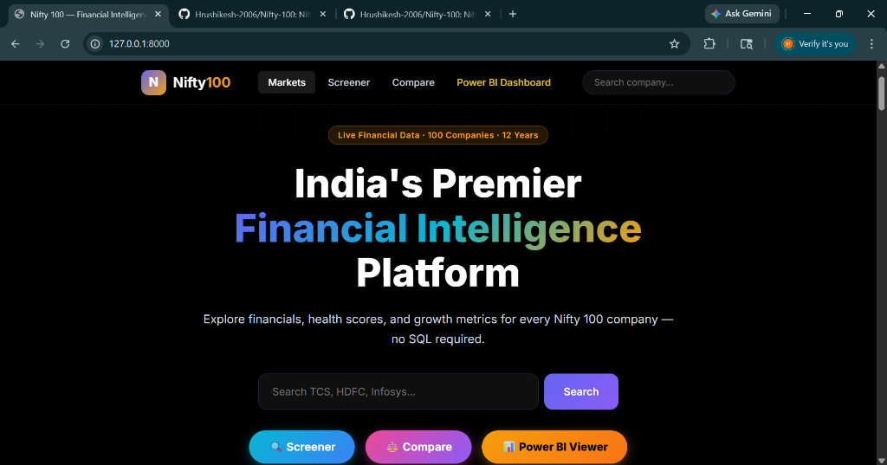
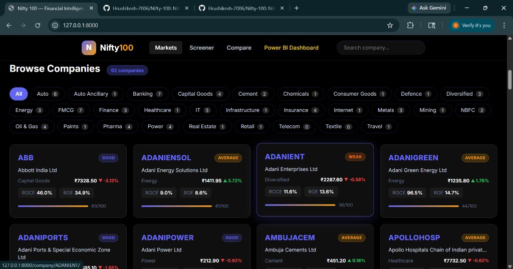
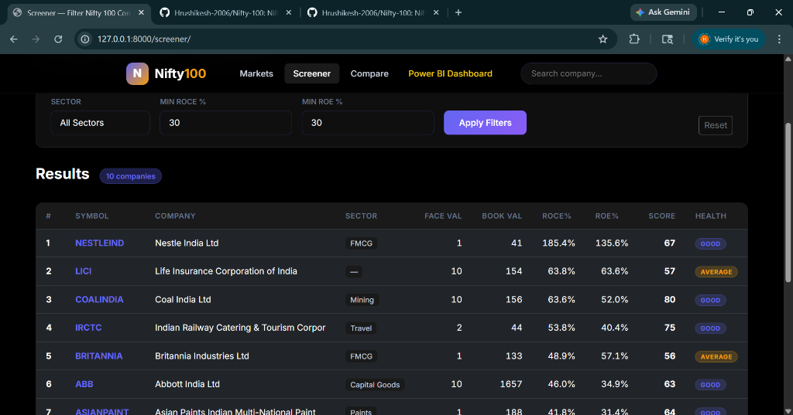
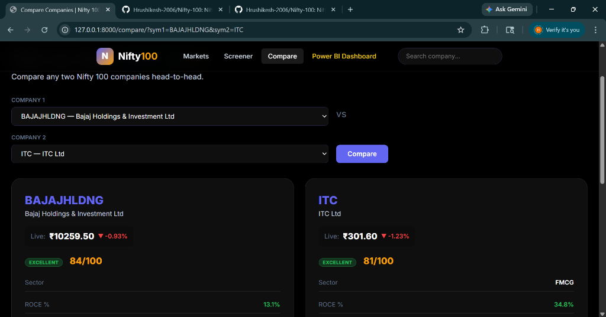
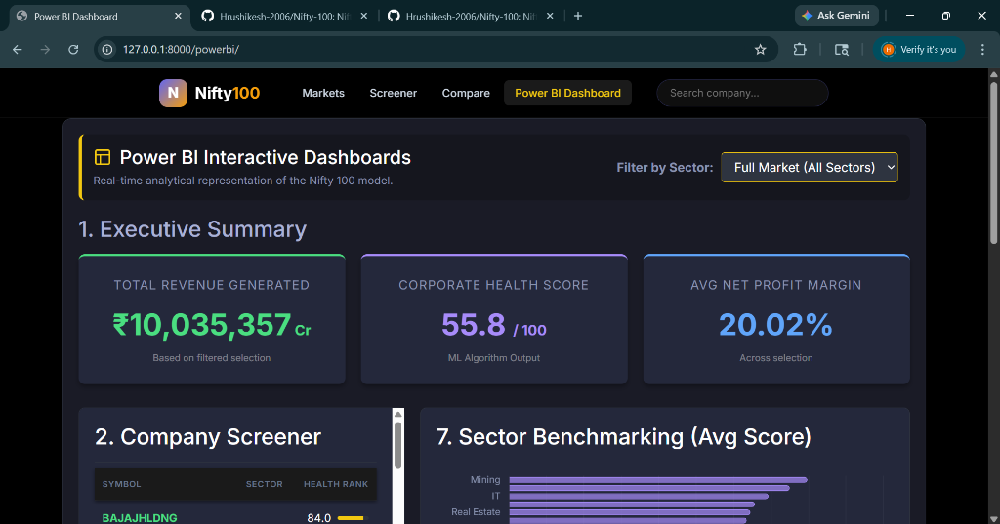

<div align="center">

# 🚀 India's Premier Financial Intelligence Platform



### *Precision Analytics for India's Top 100 Market Leaders*

[](https://www.python.org/)
[](https://www.djangoproject.com/)
[](https://redis.io/)
[](https://www.postgresql.org/)
[](LICENSE)

</div>

---

## 🌟 Project Overview

The **Nifty 100 Financial Intelligence Platform** is a high-performance web application designed for investors, analysts, and financial enthusiasts. It provides deep insights into India's top 100 companies by market capitalization, combining historical financial data with **real-time metrics** and **ML-driven health scores**.

### 🚀 Key Features
- **⚡ Real-time Market Data**: Live stock prices, revenue, and margins via FMP API.
- **🧠 ML Health Scoring**: Proprietary algorithm calculating company stability and growth potential.
- **⚖️ Side-by-Side Comparison**: Multi-metric comparison tool for benchmarking market leaders.
- **🔍 Advanced Screener**: Filter companies based on ROCE, ROE, P/E, and custom financial ratios.
- **📊 Power BI Integration**: Interactive embedded dashboards for macro-level market analysis.

---

## 🛠️ Tech Stack

<div align="center">

| Layer | Technology |
| :--- | :--- |
| **Backend** |   |
| **Frontend** |    |
| **Database** |   |
| **Caching** |  |
| **Data API** |  |
| **ML/ETL** |   |

</div>

---

## 🏗️ Architecture

<div align="center">
  
</div>

### How it Works:
1.  **Data Extraction**: The ETL pipeline fetches raw data from official exchanges and Excel files.
2.  **Processing**: Pandas and Scikit-learn clean the data and calculate **ML Health Scores**.
3.  **Real-time Sync**: The `RealtimeDataService` fetches live metrics from FMP API with a **15-minute intelligent cache**.
4.  **API Layer**: Django Rest Framework (DRF) serves JSON data to the frontend.
5.  **Frontend**: A responsive dashboard renders data with color-coded health indicators and interactive charts.

---

## 🚦 Getting Started

### 1. Clone & Install
```bash
git clone https://github.com/Hrushikesh-2006/Nifty-100.git
cd Nifty-100
pip install -r REQUIREMENTS_REALTIME.txt
```

### 2. Setup Environment
Create a `.env` file or update `config/settings.py` with your API keys:
```python
# Real-time API Key
FMP_API_KEY = "your_key_here"
```

### 3. Initialize & Run
```bash
python manage.py migrate
python manage.py fetch_realtime_data
python manage.py runserver
```

---

## 📸 Screenshots & UI

<div align="center">
  <table>
    <tr>
      <td><b>Market Overview</b></td>
      <td><b>Stock Screener</b></td>
    </tr>
    <tr>
      <td></td>
      <td></td>
    </tr>
    <tr>
      <td><b>Head-to-Head Comparison</b></td>
      <td><b>Executive Dashboard</b></td>
    </tr>
    <tr>
      <td></td>
      <td></td>
    </tr>
  </table>
</div>

---

## 📞 Support & Contact

Developed by **Hrushikesh**  
📧 [hrushikeshanumula1111@gmail.com](mailto:hrushikeshanumula1111@gmail.com)  
🔗 [GitHub Profile](https://github.com/Hrushikesh-2006)

---

<div align="center">

*Designed for the future of Financial Intelligence.*  
⭐ **Star this repo if you find it useful!**

</div>
